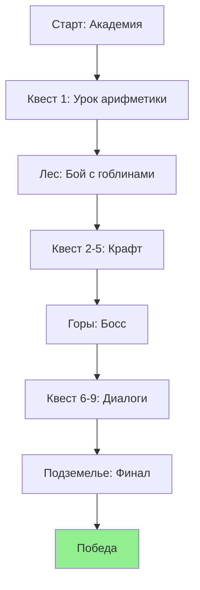

# ГОСТ 19.201-78  
# Техническое задание  
# на разработку программы  

**Наименование программы:** Академия Тайных Знаний  


**Разработчик:** Бурыхин Ярослав  

**Заказчик:** newlxp.ru 

**УТВЕРЖДАЮ**  
[Должность] __________________ [Ф.И.О.]  
"___" _____________ 2025 г.  

**СОГЛАСОВАНО**  
[Должность] __________________ [Ф.И.О.]  
"___" _____________ 2025 г.  

**Версия ТЗ:** 1.0  
**Дата:** 04 декабря 2025 г.  

## Содержание  

1. Введение  
2. Основание для разработки  
3. Назначение разработки  
4. Требования к программе  
   4.1. Требования к функциональным характеристикам  
   4.2. Требования к надежности  
   4.3. Условия эксплуатации  
   4.4. Требования к составу и параметрам технических средств  
   4.5. Требования к информационной и программной совместимости  
   4.6. Требования к маркировке и упаковке  
   4.7. Требования к транспортированию и хранению  
   4.8. Специальные требования  
5. Требования к программной документации  
6. Технико-экономические показатели  
7. Стадии и этапы разработки  
8. Порядок контроля и приемки  
9. Приложения  

## 1. Введение  

Игра "Академия Тайных Знаний" — это браузерная пошаговая RPG в фэнтезийном сеттинге магической академии Элдории. Игрок выступает в роли ученика-мага, который осваивает заклинания, сражается с монстрами и выполняет квесты. Ключевая фишка — образовательный элемент: для использования любого навыка, заклинания или крафта предмета игрок обязан решить математическую задачу (арифметика, дроби, геометрия, простые уравнения). Задачи берутся случайно из базы из 50 вариантов, с объяснением правильного ответа и фактом после решения.  

Целевая аудитория: школьники 10–12 лет (5–7 классы), интересующиеся фэнтези и желающие прокачивать математику через игру.  
Ожидаемая продолжительность прохождения: 2–4 часа.  
Платформа: веб-браузер (Chrome, Firefox, Safari последней версии).  

Жанр: RPG.  
Сеттинг: Фэнтези.  
Фишка: Образовательный элемент (интегрированные математические задачи для активации навыков и предметов).  

## 2. Основание для разработки  

Разработка осуществляется на основании запроса заказчика — студента группы [ваша группа] — для создания образовательной игры, сочетающей элементы RPG с математическими задачами. Основанием служит необходимость в увлекательном инструменте для обучения математике школьников.  

Документы-основания:  
- Требования заказчика от 04 декабря 2025 г.  

## 3. Назначение разработки  

Программа предназначена для создания увлекательной RPG, где прогресс напрямую связан с успешным решением математических задач, мотивируя игроков к обучению.  

Программа обеспечивает:  
- Реализацию системы прокачки персонажа с 3 классами и 4 основными статами.  
- Создание 5 локаций с 10 основными квестами и нелинейными побочными ветками.  
- Интеграцию образовательного модуля: 50 задач по 4 темам (по 12–13 на тему), с 95% точностью проверки ответов.  
- Обеспечение пошаговой боевой системы с 8 навыками, каждый из которых требует задачи.  
- Реализацию сохранения прогресса и лидерборда по времени прохождения.  

## 4. Требования к программе  

### 4.1. Требования к функциональным характеристикам  

- **Система персонажа:**  
  - Создание персонажа: выбор имени, класса (Алхимик — +интеллект, Воин — +сила, Странник — +ловкость), распределение 10 очков по статам (сила, интеллект, ловкость, выносливость; старт: 5 в каждом).  
  - Прокачка: за каждый уровень (макс. 15) +3 очка статов; XP от квестов (100–500 XP) и боев (20–100 XP).  

  **Таблица статов и влияния:**  

  | Стат          | Влияние                          | Формула расчета |  
  |---------------|----------------------------------|-----------------|  
  | Сила         | Урон в ближнем бою              | Урон = база × (1 + сила/10) |  
  | Интеллект    | Урон/эффект магии, успех крафта | Шанс успеха = 50% + интеллект% |  
  | Ловкость     | Уклонение, криты                | Уклон = ловкость/20 шанс |  
  | Выносливость | HP (база 100 + выносливость×10) | - |  

- **Мир и квесты:**  
  - 5 локаций: Академия (хаб), Лес (мобы), Горы (боссы), Замок (NPC), Подземелье (финал).  
  - 10 основных квестов (линейная цепочка) + 5 побочных (опционально, +ресурсы).  
  - Пример квеста "Первое заклинание": поговорить с наставником → собрать 3 ингредиента → решить задачу → получить навык "Огненный шар".  

  **Пример сценария квеста (user story):**  
  *Как ученик, я хочу получить задание от NPC, чтобы продвинуться по сюжету.*  
  1. NPC: "Решите: сколько зелий выйдет из 3/4 кг травы, если на зелье 1/8 кг?" (Ответ: 6).  
  2. Правильно → награда; неверно → подсказка и повтор (3 попытки).  

- **Боевая система:**  
  - Пошаговая: игрок/враг ходят по очереди.  
  - 8 навыков (по 2–3 на класс): каждый требует задачи (время на решение: 30 сек).  
  - Пример: "Огненный шар" (тема: дроби) — задача: "2/3 маны + 1/3 от интеллекта = ? урона".  

- **Крафт и инвентарь:**  
  - 10 рецептов (ингредиенты из локаций).  
  - Крафт требует задачи (геометрия: площадь круга для котла).  
  - Инвентарь: 20 слотов, drag&drop.  

- **Образовательный модуль:**  
  - База задач: JSON-массив, 50 задач с вопросом, вариантами (4), ответом, объяснением.  
  - Пример задачи (арифметика):  
    **Вопрос:** Сколько монет у героя, если 25 + 3×15 = ?  
    **Варианты:** A) 70 B) 55 C) 85 D) 40  
    **Ответ:** A) 70  
    **Объяснение:** Порядок действий: умножение перед сложением (3×15=45, 25+45=70). Факт: В средневековье монеты считали так же!  

- **Интерфейс:**  
  - Вид: 2D top-down (800×600 px, responsive до 1920×1080).  
  - HUD: HP/MP бары (зеленый/синий), уровень/XP, мини-карта, кнопки инвентаря/карты/сохранения.  
  - Диалоги: всплывающее окно с текстом, 3–5 выборов (влияют на репутацию NPC).  
  - Бой: сетка 5×5, иконки навыков снизу.  
  - Задачи: полноэкранный модал с таймером, кнопками вариантов.  

  **Пример UI HUD (ASCII-мокап):**  

  ```
  [HP:████░░ 80/100] [MP:███░░░ 60/100] Lv.5 [XP:███░░ 300/500]
  [Инвентарь] [Карта] [Сохранить]
  Персонаж: O
  Лес: Монстр X
  ```

  - Шрифты: fantasy (Google Fonts: "Cinzel" для текста, monospace для задач).  
  - Анимации: fade-in для диалогов, shake для урона.  

### 4.2. Требования к надежности  

- Точность проверки ответов: 95%.  
- Валидация ответов на клиенте, без возможности обмана (local).  
- Сохранение прогресса: 100% восстановление.  

### 4.3. Условия эксплуатации  

- Производительность: 60 FPS на средних ПК (i5, 8GB RAM), загрузка локаций <2 сек.  
- Доступность: клавиатура (WASD + Enter), контраст цветов >4.5:1, озвучка задач (TTS API).  
- Локализация: русский (задачи/текст), английские термины в математике.  

### 4.4. Требования к составу и параметрам технических средств  

- Платформа: веб-браузер (Chrome, Firefox, Safari последней версии).  
- Игнорировать мобильные устройства (<768px — предупреждение).  

### 4.5. Требования к информационной и программной совместимости  

- Хранение: localStorage (JSON сохранения, 1MB).  
- Лидерборд: отправка времени прохождения на Firebase Realtime DB (анонимно).  
- Звуки: Web Audio API, 10 SFX (заклинания, шаги) + 3 BGM.  
- Развертывание: GitHub Pages или Vercel.  

### 4.6. Требования к маркировке и упаковке  

Не применимо (программный продукт распространяется онлайн).  

### 4.7. Требования к транспортированию и хранению  

Не применимо (программный продукт хранится в цифровом виде).  

### 4.8. Специальные требования  

- Нет мультиплеера или онлайн-сохранений (только local).  
- Мобы: 10 типов, AI простой (агрессивный/пассивный).  
- Графика: спрайты PNG 64×64 px (20 уникальных).  
- Бюджет: 0 руб., open-source ассеты (OpenGameArt).  

## 5. Требования к программной документации  

- README с описанием управления.  
- Структура данных сохранения (JSON пример).  

## 6. Технико-экономические показатели  

- Бюджет: 0 руб. (open-source).  
- Ожидаемая продолжительность разработки: не указана.  
- Экономическая эффективность: образовательная ценность для целевой аудитории.  

## 7. Стадии и этапы разработки  

- Стадия 1: Проектирование (разработка ТЗ).  
- Стадия 2: Реализация функционала.  
- Стадия 3: Тестирование.  
- Стадия 4: Развертывание на GitHub Pages или Vercel.  

## 8. Порядок контроля и приемки  

- Персонаж создается и прокачивается (тест: 3 уровня).  
- Все 10 квестов проходятся, 5 побочных работают.  
- 50 задач решаются корректно (ручной тест 10 рандомных).  
- Бои: 10 симуляций, баланс (игрок побеждает 80% мобов).  
- Сохранение/загрузка: 100% восстановление прогресса.  
- Лидерборд: запись/чтение 5 записей.  
- Производительность: FPS >50 в бою.  
- Документация: README с управлением.  

Приёмка после демо на GitHub (pull request).  

## 9. Приложения  

### 9.1. Диаграмма прогресса (Mermaid flowchart)  



### 9.2. Структура данных (JSON примера сохранения)  

```json
{  
  "player": {  
    "name": "Герой",  
    "class": "Алхимик",  
    "stats": {"strength": 7, "intellect": 12, "dexterity": 6, "endurance": 5},  
    "level": 5,  
    "xp": 300,  
    "hp": 150,  
    "inventory": ["Зелье1", "Меч"]  
  },  
  "quests": {"main1": "completed", "side2": "active"},  
  "leaderboard_time": 7200  
}  
```  

### 9.3. Таблица навыков  

| Навык          | Класс     | Тема математики | Пример задачи                  |  
|----------------|-----------|------------------|--------------------------------|  
| Огненный шар  | Все      | Дроби          | 2/3 + 1/6 = ?                 |  
| Удар меча     | Воин     | Арифметика     | 15 × 2 + 10 = ?               |  
| Щит теней     | Странник | Геометрия      | Площадь треугольника (3,4,5)  |  

